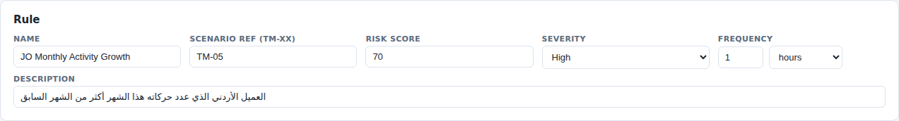
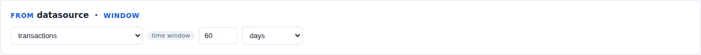
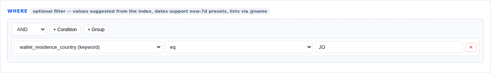
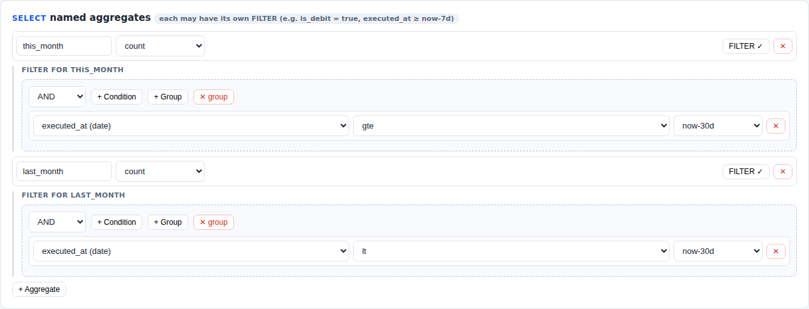
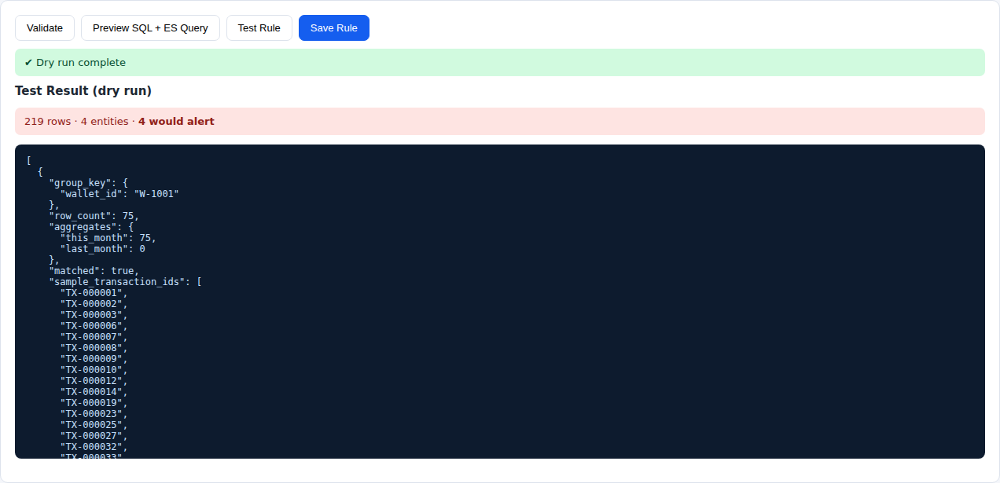
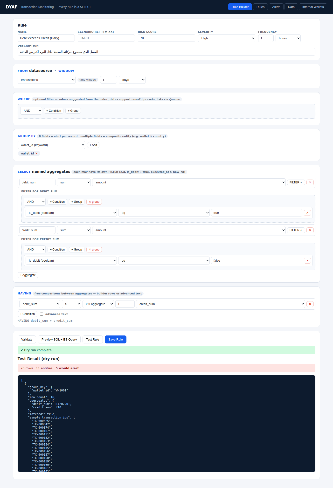
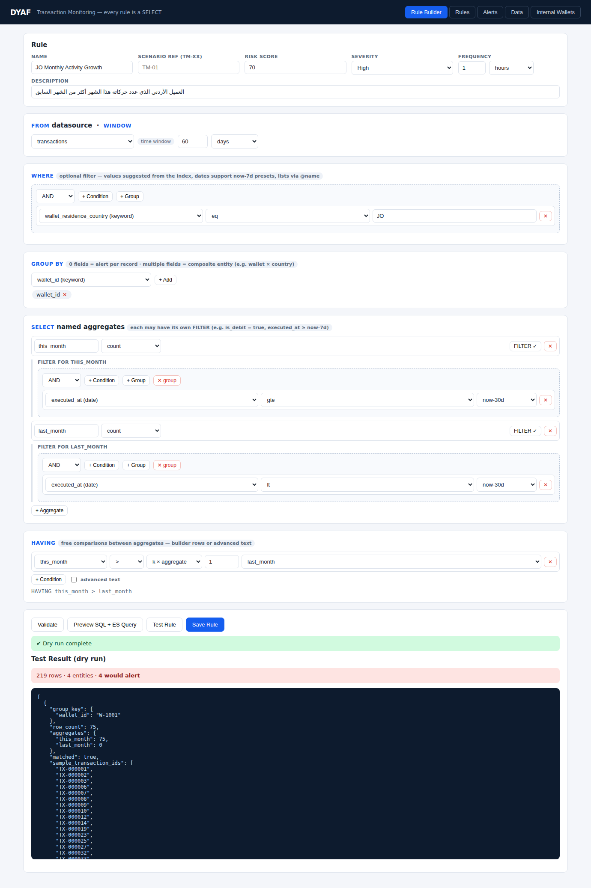
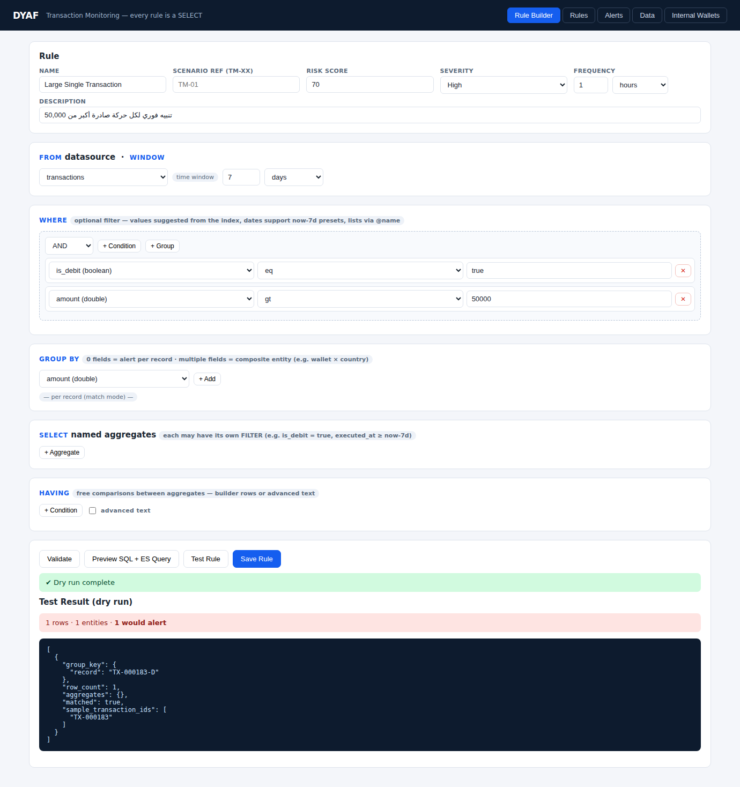

# دليل المستخدم — شاشة Rule Builder

هذا الدليل موجّه للمستخدم النهائي (محلل الامتثال / مكافحة الاحتيال) لبناء قواعد
الكشف بدون كتابة كود.

## المبدأ العام

كل قاعدة في النظام هي **استعلام SELECT**: تختار *من أين* تقرأ الحركات (FROM)،
*أي الحركات* تدخل الحساب (WHERE)، *على مستوى مَن* تجمّع (GROUP BY)، *ماذا
تحسب* (SELECT)، و*متى يصدر التنبيه* (HAVING). الشاشة مرتبة بهذا الترتيب من
الأعلى للأسفل — تعبئتها بالترتيب تعطيك قاعدة كاملة.

> ⚠️ تذكّر: كل حركة مالية مخزنة **سجلين** — سجل بمنظور المرسل (`is_debit = true`)
> وسجل بمنظور المستقبل (`is_debit = false`). حقل `wallet_id` في كل سجل هو
> «صاحب المنظور»، و`counterparty_wallet_id` هو الطرف الآخر، وكل صفات محفظة
> صاحب المنظور متاحة بحقول تبدأ بـ `wallet_` (مثل `wallet_residence_country`).

---

## أقسام الشاشة

### 1) Rule — بيانات القاعدة

| الحقل | معناه |
|---|---|
| **Name** | اسم القاعدة كما سيظهر في التنبيهات وكتالوج القواعد |
| **Scenario Ref** | مرجع اختياري لربط القاعدة بسيناريو الكتالوج (TM-01…) |
| **Risk Score** | درجة المخاطر (0–100) التي ستُلحق بكل تنبيه تولده القاعدة |
| **Severity** | شدة التنبيه: Low / Medium / High / Critical |
| **Frequency** | كل كم يشغّل المجدول هذه القاعدة تلقائياً (مثلاً كل ساعة) |
| **Description** | وصف حر يشرح ماذا تكشف القاعدة |

### 2) FROM · WINDOW — مصدر البيانات والنافذة الزمنية

- **Datasource**: الفهرس الذي تُقرأ منه السجلات (الافتراضي `transactions`؛
  أي مصدر يضيفه المسؤول من تبويب Data يظهر هنا تلقائياً).
- **Time Window**: الفترة الزمنية التي تفحصها القاعدة عند كل تشغيل —
  «آخر يوم»، «آخر 7 أيام»، «آخر 60 يوماً»… القاعدة لا ترى شيئاً أقدم من
  النافذة، لذا عند مقارنة فترتين (شهر بشهر) يجب أن تغطي النافذة الفترتين معاً.

### 3) WHERE — فلترة السجلات (اختياري)

يحدد أي السجلات تدخل الحساب أصلاً. كل شرط = **حقل + مشغّل + قيمة**:

- **الحقل**: قائمة منسدلة بكل حقول المصدر (تُكتشف تلقائياً)، بما فيها حقول
  المحفظة المدموجة (`wallet_*`) والحقول المحسوبة.
- **المشغّل**: eq, neq, gt, gte, lt, lte, in, not_in, between, contains,
  starts_with, exists, missing.
- **القيمة**: للحقول النصية تُقترح القيم الموجودة فعلاً في الفهرس؛ لحقول
  التاريخ تظهر قائمة أوقات نسبية جاهزة (`now-7d`، `now-30d`…) أو منتقي
  تاريخ دقيق؛ ويمكن الإشارة لقائمة مُدارة بكتابة `@اسم_القائمة`
  (مثل `@high_risk_countries`).
- **+ Group**: مجموعات شروط متداخلة بمنطق AND / OR / NOT، والسحب يعيد الترتيب.

### 4) GROUP BY — مستوى التجميع

يحدد «الكيان» الذي يصدر التنبيه باسمه:

| الاختيار | النتيجة |
|---|---|
| **بدون حقول** | وضع المطابقة: تنبيه مستقل **لكل سجل** يطابق WHERE (لا حاجة لـ SELECT/HAVING) |
| **حقل واحد** (مثل `wallet_id`) | تنبيه لكل عميل تتحقق فيه شروط HAVING |
| **عدة حقول** (مثل `wallet_id` + `merchant_country`) | كيان مركّب — تنبيه لكل «عميل×دولة» مثلاً |

### 5) SELECT — التجميعات المسماة

هنا تعرّف **ماذا تحسب** لكل كيان. كل سطر تجميع يتكون من:

- **الاسم**: اسم حر تشير به لاحقاً في HAVING (مثل `debit_sum`, `this_month`).
- **الدالة**: count · count_distinct · sum · avg · min · max.
- **الحقل**: مطلوب لكل الدوال عدا count.
- **FILTER** (اختياري): شروط تخص هذا التجميع وحده — وهذا أهم مفهوم في
  الشاشة: `sum(amount)` بفلتر `is_debit = true` يعطيك مجموع الصادر فقط،
  و`count` بفلتر `executed_at >= now-30d` يعطيك عدد حركات آخر شهر فقط.

أضف أي عدد من التجميعات — المقارنة بينها تتم في HAVING.

### 6) HAVING — شرط إطلاق التنبيه

تعبير حر يقارن التجميعات ببعضها أو بأرقام. لكل سطر:
**تجميع** + **مشغّل** (>, >=, <, <=, ==, !=) + الطرف الأيمن إما **رقم** أو
**k × تجميع آخر** (المضاعِف k يتيح «أكبر من ثلاثة أضعاف…»). الأسطر تُربط بـ
AND / OR، والناتج يظهر تحتها فوراً بصيغة SQL.

لمن يفضل الكتابة: فعّل **advanced text** واكتب التعبير مباشرة، مثل:
`recent >= 1 AND prior == 0` أو `total > 3 * declared`.

### 7) أزرار التنفيذ

| الزر | وظيفته |
|---|---|
| **Validate** | فحص القاعدة (حقول موجودة؟ تعبير HAVING سليم؟) دون تنفيذ |
| **Preview SQL + ES Query** | عرض جملة SQL المقروءة + استعلام Elasticsearch الفعلي |
| **Test Rule** | تشغيل تجريبي فوري: كم سجلاً قُرئ، كم كياناً قُيّم، مَن سيُنبَّه وبأي قيم — **دون حفظ أي تنبيه** |
| **Save Rule** | حفظ القاعدة (كل حفظ يرفع رقم الإصدار) ثم فعّلها من تبويب Rules |

---

## أمثلة كاملة

### مثال 1 — «العميل الذي صادره اليوم أكثر من وارده»

| القسم | الإعداد |
|---|---|
| WINDOW | `1 days` |
| WHERE | فارغ |
| GROUP BY | `wallet_id` |
| SELECT | `debit_sum = sum(amount)` FILTER `is_debit = true` · `credit_sum = sum(amount)` FILTER `is_debit = false` |
| HAVING | `debit_sum > credit_sum` |

**الفكرة**: فلترا `is_debit` يفصلان الصادر عن الوارد لنفس العميل، وHAVING يقارنهما.

### مثال 2 — «الأردني الذي عدد حركاته هذا الشهر أكثر من الشهر السابق»

| القسم | الإعداد |
|---|---|
| WINDOW | `60 days` (يغطي الشهرين) |
| WHERE | `wallet_residence_country eq JO` |
| GROUP BY | `wallet_id` |
| SELECT | `this_month = count` FILTER `executed_at gte now-30d` · `last_month = count` FILTER `executed_at lt now-30d` |
| HAVING | `this_month > last_month` |

**الفكرة**: نمط «مقارنة فترتين» — فلتران زمنيان على نفس الحد `now-30d`
يقسمان النافذة لشهرين. أضف `last_month > 0` لاستبعاد العملاء الجدد،
أو ارفع المضاعِف إلى 1.5 لاشتراط نمو حقيقي.

### مثال 3 — «تنبيه فوري لكل حركة صادرة أكبر من 50,000» (وضع المطابقة)

| القسم | الإعداد |
|---|---|
| WINDOW | `7 days` |
| WHERE | `is_debit eq true` AND `amount gt 50000` |
| GROUP BY | **فارغ** |
| SELECT / HAVING | **فارغان** |

**الفكرة**: بلا GROUP BY ولا SELECT، تصبح القاعدة «مطابقة مباشرة»: تنبيه
مستقل لكل سجل حققت شروطه WHERE — الأنسب للحدود الثابتة الفورية.

---

## نصائح وأخطاء شائعة

1. **النافذة أقصر من الفلاتر الزمنية**: إن استخدمت `executed_at < now-30d`
   في فلتر تجميع بينما النافذة 7 أيام، فلن يصل أي سجل قديم أصلاً — اجعل
   النافذة تغطي أبعد فلتر زمني.
2. **قارن الصادر فقط عند الحاجة**: بدون فلتر `is_debit` يُحسب السجلان معاً
   (منظور المرسل ومنظور المستقبل).
3. **جرّب قبل الحفظ دائماً**: زر Test يعرض قيم كل تجميع لكل كيان — أفضل
   طريقة لمعايرة الحدود قبل التفعيل.
4. **القوالب الجاهزة**: تبويب Rules فيه كتالوج TM-01…TM-12 محمّلاً مسبقاً —
   افتح أي قاعدة بزر Edit لتتعلم منها أو تعدّل حدودها.
5. **القوائم بدل تكرار القيم**: بدل كتابة قائمة الدول في كل قاعدة، عرّف
   قائمة مُدارة من تبويب Data واستخدم `@اسم_القائمة`.
6. **الحقول المحسوبة**: إن احتجت شرطاً على ناتج معادلة (مثل «مبلغ مدوّر»)
   عرّف حقلاً محسوباً من تبويب Data (`is_round = amount % 1000 == 0`)
   ثم استخدمه كأي حقل عادي.
